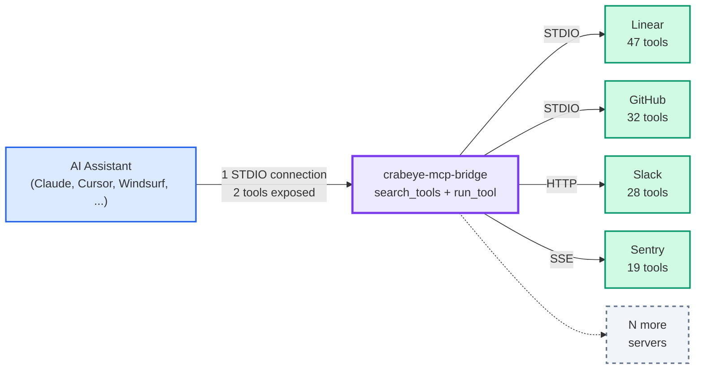

# Crabeye MCP Bridge

One MCP connection for all your tools — with discovery, namespacing, and execution policies.

Every MCP server you add to your AI assistant means another connection, another set of tool definitions injected into the context window, and no way to search or control them centrally. Wire up ten servers with a hundred tools each and your assistant is burning tokens on a thousand tool schemas before the conversation even starts — most of which it will never call.

crabeye-mcp-bridge consolidates all your upstream MCP servers behind a single STDIO interface and exposes exactly **two tools** to the assistant: `search_tools` and `run_tool`. Tools from every server are discovered, namespaced, and indexed at startup, but none of them touch the context window until the assistant actually searches for them. You can have a thousand tools ready to go without bloating the context, with fuzzy search to find them and per-tool execution policies to control what runs freely, what needs approval, and what is blocked.



## Quick start

Say your MCP client config looks like this today:

```json
{
  "mcpServers": {
    "linear": {
      "command": "npx",
      "args": ["-y", "@anthropic/linear-mcp-server"]
    },
    "github": {
      "command": "npx",
      "args": ["-y", "@anthropic/github-mcp-server"],
      "env": {
        "GITHUB_TOKEN": "ghp_..."
      }
    }
  }
}
```

To use the bridge, rename `mcpServers` to `upstreamMcpServers` and add the bridge as the only entry in `mcpServers`:

```json
{
  "mcpServers": {
    "bridge": {
      "command": "npx",
      "args": ["-y", "@crabeye-ai/crabeye-mcp-bridge", "--config", "/path/to/this/file.json"]
    }
  },
  "upstreamMcpServers": {
    "linear": {
      "command": "npx",
      "args": ["-y", "@anthropic/linear-mcp-server"]
    },
    "github": {
      "command": "npx",
      "args": ["-y", "@anthropic/github-mcp-server"],
      "env": {
        "GITHUB_TOKEN": "ghp_..."
      }
    }
  }
}
```

That's it. Your AI assistant now has access to all tools from all configured servers through a single connection. The bridge automatically excludes itself from `mcpServers` to avoid recursion, so pointing `--config` at the same file is safe.

The bridge also reads `servers` (VS Code Copilot) and `context_servers` (Zed) as input keys. On duplicate names, earlier sources win: `upstreamMcpServers` > `servers` > `context_servers` > `mcpServers`. Self-exclusion applies to `mcpServers` and `context_servers`.

Alternatively, you can add the bridge alongside your existing `mcpServers` entries without renaming anything:

```json
{
  "mcpServers": {
    "bridge": {
      "command": "npx",
      "args": ["-y", "@crabeye-ai/crabeye-mcp-bridge", "--config", "/path/to/this/file.json"]
    },
    "linear": {
      "command": "npx",
      "args": ["-y", "@anthropic/linear-mcp-server"]
    },
    "github": {
      "command": "npx",
      "args": ["-y", "@anthropic/github-mcp-server"],
      "env": {
        "GITHUB_TOKEN": "ghp_..."
      }
    }
  }
}
```

The bridge will pick up the other servers from `mcpServers` automatically (excluding itself). This makes it easier to see at a glance in your client which MCP servers are configured. However, you'll want to disable the other MCP servers in your client so the assistant uses the bridge as the single entry point rather than calling them directly, otherwise it defeats the purpose of using this tool.

You can, of course, also use a completely different config file for the bridge. It will work as long as you add the bridge to your client's MCP config.

## How it works

On startup the bridge launches every configured upstream server, connects to it, and discovers its tools. Each tool is namespaced by server name (e.g. `linear__create_issue`, `github__list_repos`) so tools from different servers never collide.

Two meta-tools are exposed to the AI assistant:

- **`search_tools`** — Fuzzy-search across all discovered tools by name, description, provider, or category. Matching tools are automatically enabled for use.
- **`run_tool`** — Execute any discovered tool directly by its namespaced name (e.g. `linear__create_issue`).

The AI assistant calls `search_tools` automatically when it detects a relevant intent, then uses `run_tool` or calls the auto-enabled tools directly.

When `search_tools` is called, the assistant receives the matching tools and their input schemas. The bridge also directly exposes the searched tools to the assistant so they can be called natively. Some assistants don't refresh their tool list mid-session, so they may not see the newly exposed tools — but they can still call them through `run_tool` and the call is executed exactly as if made directly on the original tool.

## Examples

### Discovering providers

The assistant starts by searching for providers to see what's available. Without a `tool` filter, provider summaries are returned — name, category, and tool count, but no tool details:

```json
{
  "name": "search_tools",
  "arguments": {
    "queries": [{ "provider": "linear" }]
  }
}
```

Response:

```json
{
  "results": [
    {
      "providers": [
        {
          "name": "linear",
          "category": "project management",
          "tool_count": 47,
          "tools": []
        }
      ],
      "total": 47,
      "count": 0,
      "offset": 0,
      "limit": 10
    }
  ]
}
```

To get full tool definitions, add `expand_tools: true` or use a `tool` filter to drill in:

```json
{
  "name": "search_tools",
  "arguments": {
    "queries": [{ "provider": "linear", "expand_tools": true }]
  }
}
```

### Searching for tools

The assistant calls `search_tools` with a `tool` filter to find specific tools by name or description. Results are grouped by provider:

```json
{
  "name": "search_tools",
  "arguments": {
    "queries": [{ "tool": "create issue" }]
  }
}
```

The bridge returns matching tools with their full input schemas, grouped by provider:

```json
{
  "results": [
    {
      "providers": [
        {
          "name": "linear",
          "category": "project management",
          "tool_count": 47,
          "tools": [
            {
              "tool_name": "linear__create_issue",
              "source": "linear",
              "description": "Create a new Linear issue",
              "input_schema": {
                "type": "object",
                "properties": {
                  "title": { "type": "string" },
                  "team": { "type": "string" },
                  "description": { "type": "string" }
                },
                "required": ["title", "team"]
              }
            }
          ]
        },
        {
          "name": "github",
          "tool_count": 32,
          "tools": [
            {
              "tool_name": "github__create_issue",
              "source": "github",
              "description": "Create a GitHub issue",
              "input_schema": { "..." }
            }
          ]
        }
      ],
      "total": 2,
      "count": 2,
      "offset": 0,
      "limit": 10
    }
  ]
}
```

Matching tools are automatically enabled for direct use by the assistant — no extra step needed.

### Multiple queries

Pass multiple query objects to search for different things in a single call. Results are deduplicated across queries — first query wins. Summary and detail queries can be mixed:

```json
{
  "name": "search_tools",
  "arguments": {
    "queries": [
      { "tool": "create issue" },
      { "provider": "github" },
      { "category": "design", "expand_tools": true }
    ]
  }
}
```

The first query returns tool details (has `tool` filter), the second returns a provider summary, and the third returns expanded tool details for design tools. Each query produces its own result set with independent pagination.

### Running a tool directly

If the assistant already knows the namespaced name, it can skip the search and call `run_tool` directly:

```json
{
  "name": "run_tool",
  "arguments": {
    "name": "linear__create_issue",
    "arguments": {
      "title": "Fix login crash",
      "team": "Engineering",
      "description": "The app crashes on login when the session token is expired"
    }
  }
}
```

The response is passed through exactly as the upstream server returns it.

### Filtering by provider

Combine a tool search with a provider filter to narrow results:

```json
{
  "name": "search_tools",
  "arguments": {
    "queries": [{ "tool": "list", "provider": "github" }]
  }
}
```

Only tools from the `github` server matching "list" are returned, grouped under the `github` provider. Provider matching uses prefix match by default (`"git"` matches `"github"`, but `"hub"` does not).

### Regex search

For precise matching, prefix the tool query with `regex:`:

```json
{
  "name": "search_tools",
  "arguments": {
    "queries": [{ "tool": "regex:^list_" }]
  }
}
```

This finds all tools whose name starts with `list_` — across every server.

## Configuration

### STDIO servers

Servers that run as local subprocesses:

```json
{
  "upstreamMcpServers": {
    "my-server": {
      "command": "node",
      "args": ["./server.js"],
      "env": { "API_KEY": "..." }
    }
  }
}
```

### HTTP servers

Remote servers accessible via HTTP:

```json
{
  "upstreamMcpServers": {
    "remote-server": {
      "url": "https://mcp.example.com/sse",
      "type": "sse",
      "headers": { "Authorization": "Bearer ..." }
    }
  }
}
```

`type` defaults to `"streamable-http"`. Use `"sse"` for servers that use Server-Sent Events transport.

### Categories

Assign a category to a server so tools can be discovered by domain rather than server name:

```json
{
  "upstreamMcpServers": {
    "linear": {
      "command": "npx",
      "args": ["-y", "@anthropic/linear-mcp-server"],
      "_bridge": {
        "category": "project management"
      }
    },
    "figma": {
      "command": "npx",
      "args": ["-y", "@anthropic/figma-mcp-server"],
      "_bridge": {
        "category": "design"
      }
    }
  }
}
```

The assistant can then search by category: `{ "queries": [{ "category": "design" }] }`. Category matching uses prefix match by default, so `"project"` matches `"project management"`. Use `regex:` prefix for pattern matching.

### Authentication

Static credentials (API keys, tokens) can be passed via `env` or `headers` in the server config. OAuth is not yet supported.

### Tool policies

Control which tools can run automatically, require confirmation, or are blocked entirely. Three policy values:

- `"always"` — tool runs without confirmation (default)
- `"prompt"` — user is asked to approve each call via MCP elicitation
- `"never"` — tool is disabled and cannot be called

Policies cascade in this order (first match wins):

1. Per-tool (`_bridge.tools.<toolName>`)
2. Per-server (`_bridge.toolPolicy`)
3. Global (`_bridge.toolPolicy`)
4. Default: `"always"`

```json
{
  "upstreamMcpServers": {
    "linear": {
      "command": "npx",
      "args": ["-y", "@anthropic/linear-mcp-server"],
      "_bridge": {
        "toolPolicy": "prompt",
        "tools": {
          "list_issues": "always",
          "delete_issue": "never"
        }
      }
    }
  },
  "_bridge": {
    "toolPolicy": "always"
  }
}
```

In this example, all Linear tools require confirmation except `list_issues` (runs freely) and `delete_issue` (blocked). Tools from other servers use the global default (`"always"`).

## CLI

```
npx @crabeye-ai/crabeye-mcp-bridge --config <path>
```

| Flag | Description |
|------|-------------|
| `-c, --config <path>` | Path to config file (required, or set `MCP_BRIDGE_CONFIG`) |
| `--validate` | Validate config and list upstream servers, then exit |
| `-V, --version` | Print version |
| `-h, --help` | Print help |

### Validating your config

Use `--validate` to check your config file without starting the bridge:

```
$ npx @crabeye-ai/crabeye-mcp-bridge --config config.json --validate
Config OK — 3 upstream servers
  linear (stdio) [project management]
  github (stdio)
  sentry (streamable-http)
```

Exits with code 0 on success, code 1 on validation errors.

## License

MIT
