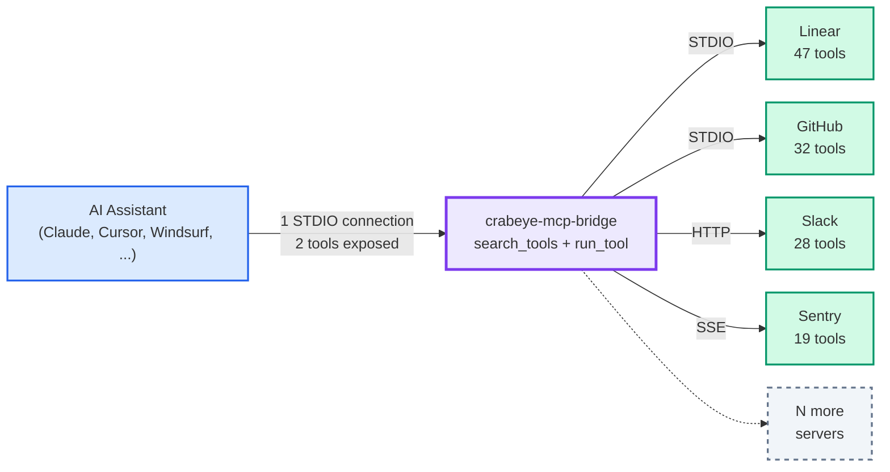

# Crabeye MCP Bridge

One MCP connection for all your tools — with discovery, namespacing, and execution policies.

Every MCP server you add to your AI assistant means another connection, another set of tool definitions injected into the context window, and no way to search or control them centrally. Wire up ten servers with a hundred tools each and your assistant is burning tokens on a thousand tool schemas before the conversation even starts — most of which it will never call.

crabeye-mcp-bridge consolidates all your upstream MCP servers behind a single STDIO interface and exposes exactly **two tools** to the assistant: `search_tools` and `run_tool`. Tools from every server are discovered, namespaced, and indexed at startup, but none of them touch the context window until the assistant actually searches for them. You can have a thousand tools ready to go without bloating the context, with fuzzy search to find them and per-tool execution policies to control what runs freely, what needs approval, and what is blocked.


```mermaid
%%{init: {'flowchart': {'nodeSpacing': 25, 'rankSpacing': 70}}}%%
flowchart LR
    classDef client fill:#dbeafe,stroke:#2563eb,stroke-width:2px
    classDef bridge fill:#ede9fe,stroke:#7c3aed,stroke-width:3px
    classDef server fill:#d1fae5,stroke:#059669,stroke-width:2px
    classDef more fill:#f1f5f9,stroke:#64748b,stroke-width:2px,stroke-dasharray:5 5

    A["AI Assistant<br/>(Claude, Cursor, Windsurf, ...)"]:::client
    A -- "1 STDIO connection<br/>2 tools exposed" --> B
    B["crabeye-mcp-bridge<br/>search_tools + run_tool"]:::bridge

    B -- STDIO --> C["Linear<br/>47 tools"]:::server
    B -- STDIO --> D["GitHub<br/>32 tools"]:::server
    B -- HTTP --> E["Slack<br/>28 tools"]:::server
    B -- SSE --> F["Sentry<br/>19 tools"]:::server
    B -.-> G["N more<br/>servers"]:::more
```

## Quick start

The fastest way to get started is with `init`, which discovers your MCP client configs and sets up the bridge automatically:

```bash
npx @crabeye-ai/crabeye-mcp-bridge init
```

This scans for config files from Claude Desktop, Cursor, VS Code Copilot, Windsurf, and Zed, lets you pick which ones to use, and optionally injects the bridge entry. After that, just run `npx @crabeye-ai/crabeye-mcp-bridge` — no `--config` flag needed.

To undo, run `npx @crabeye-ai/crabeye-mcp-bridge restore`.

### Manual setup

If you prefer to set things up manually, say your MCP client config looks like this today:

```json
{
  "mcpServers": {
    "linear": {
      "command": "npx",
      "args": ["-y", "@anthropic/linear-mcp-server"]
    },
    "github": {
      "command": "npx",
      "args": ["-y", "@anthropic/github-mcp-server"],
      "env": {
        "GITHUB_TOKEN": "ghp_..."
      }
    }
  }
}
```

First, store your secrets in the encrypted credential store:

```bash
crabeye-mcp-bridge credential set github-pat ghp_abc123
```

Then rename `mcpServers` to `upstreamMcpServers`, add the bridge, and replace hardcoded tokens with `${credential:key}` references:

```json
{
  "mcpServers": {
    "bridge": {
      "command": "npx",
      "args": ["-y", "@crabeye-ai/crabeye-mcp-bridge", "--config", "/path/to/this/file.json"]
    }
  },
  "upstreamMcpServers": {
    "linear": {
      "command": "npx",
      "args": ["-y", "@anthropic/linear-mcp-server"]
    },
    "github": {
      "command": "npx",
      "args": ["-y", "@anthropic/github-mcp-server"],
      "env": {
        "GITHUB_TOKEN": "${credential:github-pat}"
      }
    }
  }
}
```

That's it. Your AI assistant now has access to all tools from all configured servers through a single connection. The bridge automatically excludes itself from `mcpServers` to avoid recursion, so pointing `--config` at the same file is safe.

The bridge also reads `upstreamServers` (shorthand), `servers` (VS Code Copilot), and `context_servers` (Zed) as input keys. On duplicate names, earlier sources win: `upstreamMcpServers` > `upstreamServers` > `servers` > `context_servers` > `mcpServers`. Self-exclusion applies to `mcpServers` and `context_servers`.

Alternatively, you can add the bridge alongside your existing `mcpServers` entries without renaming anything:

```json
{
  "mcpServers": {
    "bridge": {
      "command": "npx",
      "args": ["-y", "@crabeye-ai/crabeye-mcp-bridge", "--config", "/path/to/this/file.json"]
    },
    "linear": {
      "command": "npx",
      "args": ["-y", "@anthropic/linear-mcp-server"]
    },
    "github": {
      "command": "npx",
      "args": ["-y", "@anthropic/github-mcp-server"],
      "env": {
        "GITHUB_TOKEN": "${credential:github-pat}"
      }
    }
  }
}
```

The bridge will pick up the other servers from `mcpServers` automatically (excluding itself). This makes it easier to see at a glance in your client which MCP servers are configured. However, you'll want to disable the other MCP servers in your client so the assistant uses the bridge as the single entry point rather than calling them directly, otherwise it defeats the purpose of using this tool.

You can, of course, also use a completely different config file for the bridge. It will work as long as you add the bridge to your client's MCP config.

## How it works

On startup the bridge launches every configured upstream server, connects to it, and discovers its tools. Each tool is namespaced by server name (e.g. `linear__create_issue`, `github__list_repos`) so tools from different servers never collide.

Two meta-tools are exposed to the AI assistant:

- **`search_tools`** — Fuzzy-search across all discovered tools by name, description, provider, or category. Matching tools are automatically enabled for use.
- **`run_tool`** — Execute any discovered tool directly by its namespaced name (e.g. `linear__create_issue`).

The AI assistant calls `search_tools` automatically when it detects a relevant intent, then uses `run_tool` or calls the auto-enabled tools directly.

When `search_tools` is called, the assistant receives the matching tools and their input schemas. The bridge also directly exposes the searched tools to the assistant so they can be called natively. Some assistants don't refresh their tool list mid-session, so they may not see the newly exposed tools — but they can still call them through `run_tool` and the call is executed exactly as if made directly on the original tool.

The bridge tracks how many tokens it saves compared to exposing all upstream tool definitions directly. Token savings are always logged to stderr after each search. To also include them in `search_tools` responses, pass `--stats`:

```json
{
  "session_stats": {
    "tokens_saved": 11200,
    "baseline_tokens": 14200,
    "bridge_tokens": 3000
  },
  "results": [...]
}
```

- **`baseline_tokens`** — estimated tokens if all upstream tool definitions were injected into context without the bridge
- **`bridge_tokens`** — cumulative tokens used by the bridge's two meta-tools plus all search results returned so far
- **`tokens_saved`** — the difference (baseline − bridge)

Token counts are estimated using a chars/4 heuristic.

## Examples

### Discovering providers

The assistant starts by searching for providers to see what's available. Without a `tool` filter, provider summaries are returned — name, category, and tool count, but no tool details:

```json
{
  "name": "search_tools",
  "arguments": {
    "queries": [{ "provider": "linear" }]
  }
}
```

Response:

```json
{
  "results": [
    {
      "providers": [
        {
          "name": "linear",
          "category": "project management",
          "tool_count": 47,
          "tools": []
        }
      ],
      "total": 47,
      "count": 0,
      "offset": 0,
      "limit": 10
    }
  ]
}
```

To get full tool definitions, add `expand_tools: true` or use a `tool` filter to drill in:

```json
{
  "name": "search_tools",
  "arguments": {
    "queries": [{ "provider": "linear", "expand_tools": true }]
  }
}
```

### Searching for tools

The assistant calls `search_tools` with a `tool` filter to find specific tools by name or description. Results are grouped by provider:

```json
{
  "name": "search_tools",
  "arguments": {
    "queries": [{ "tool": "create issue" }]
  }
}
```

The bridge returns matching tools with their full input schemas, grouped by provider:

```json
{
  "results": [
    {
      "providers": [
        {
          "name": "linear",
          "category": "project management",
          "tool_count": 47,
          "tools": [
            {
              "tool_name": "linear__create_issue",
              "source": "linear",
              "description": "Create a new Linear issue",
              "input_schema": {
                "type": "object",
                "properties": {
                  "title": { "type": "string" },
                  "team": { "type": "string" },
                  "description": { "type": "string" }
                },
                "required": ["title", "team"]
              }
            }
          ]
        },
        {
          "name": "github",
          "tool_count": 32,
          "tools": [
            {
              "tool_name": "github__create_issue",
              "source": "github",
              "description": "Create a GitHub issue",
              "input_schema": { "..." }
            }
          ]
        }
      ],
      "total": 2,
      "count": 2,
      "offset": 0,
      "limit": 10
    }
  ]
}
```

Matching tools are automatically enabled for direct use by the assistant — no extra step needed.

### Multiple queries

Pass multiple query objects to search for different things in a single call. Results are deduplicated across queries — first query wins. Summary and detail queries can be mixed:

```json
{
  "name": "search_tools",
  "arguments": {
    "queries": [
      { "tool": "create issue" },
      { "provider": "github" },
      { "category": "design", "expand_tools": true }
    ]
  }
}
```

The first query returns tool details (has `tool` filter), the second returns a provider summary, and the third returns expanded tool details for design tools. Each query produces its own result set with independent pagination.

### Running a tool directly

If the assistant already knows the namespaced name, it can skip the search and call `run_tool` directly:

```json
{
  "name": "run_tool",
  "arguments": {
    "name": "linear__create_issue",
    "arguments": {
      "title": "Fix login crash",
      "team": "Engineering",
      "description": "The app crashes on login when the session token is expired"
    }
  }
}
```

The response is passed through exactly as the upstream server returns it.

### Filtering by provider

Combine a tool search with a provider filter to narrow results:

```json
{
  "name": "search_tools",
  "arguments": {
    "queries": [{ "tool": "list", "provider": "github" }]
  }
}
```

Only tools from the `github` server matching "list" are returned, grouped under the `github` provider. Provider matching uses prefix match by default (`"git"` matches `"github"`, but `"hub"` does not).

### Regex search

For precise matching, prefix the tool query with `regex:`:

```json
{
  "name": "search_tools",
  "arguments": {
    "queries": [{ "tool": "regex:^list_" }]
  }
}
```

This finds all tools whose name starts with `list_` — across every server.

## Configuration

### STDIO servers

Servers that run as local subprocesses:

```json
{
  "upstreamMcpServers": {
    "my-server": {
      "command": "node",
      "args": ["./server.js"],
      "env": { "API_KEY": "..." }
    }
  }
}
```

### HTTP servers

Remote servers accessible via HTTP:

```json
{
  "upstreamMcpServers": {
    "remote-server": {
      "url": "https://mcp.example.com/sse",
      "type": "sse",
      "headers": { "Authorization": "Bearer ..." }
    }
  }
}
```

`type` defaults to `"streamable-http"`. Use `"sse"` for servers that use Server-Sent Events transport.

### Categories

Assign a category to a server so tools can be discovered by domain rather than server name:

```json
{
  "upstreamMcpServers": {
    "linear": {
      "command": "npx",
      "args": ["-y", "@anthropic/linear-mcp-server"],
      "_bridge": {
        "category": "project management"
      }
    },
    "figma": {
      "command": "npx",
      "args": ["-y", "@anthropic/figma-mcp-server"],
      "_bridge": {
        "category": "design"
      }
    }
  }
}
```

The assistant can then search by category: `{ "queries": [{ "category": "design" }] }`. Category matching uses prefix match by default, so `"project"` matches `"project management"`. Use `regex:` prefix for pattern matching.

### Authentication

Secrets belong in the encrypted credential store, not in config files. Store a secret once, then reference it with `${credential:key}` in `env` or `headers`:

```bash
# Store credentials
crabeye-mcp-bridge credential set github-pat ghp_abc123
crabeye-mcp-bridge credential set remote-api-key sk_live_xyz
```

```json
{
  "upstreamMcpServers": {
    "github": {
      "command": "npx",
      "args": ["-y", "@anthropic/github-mcp-server"],
      "env": { "GITHUB_TOKEN": "${credential:github-pat}" }
    },
    "remote-api": {
      "url": "https://mcp.example.com/sse",
      "type": "sse",
      "headers": { "Authorization": "Bearer ${credential:remote-api-key}" }
    }
  }
}
```

Templates are resolved on every connect and reconnect, so rotating a credential takes effect without restarting the bridge.

**How it works:** Credentials are encrypted with AES-256-GCM. The master key is stored in your OS keychain (macOS Keychain, Linux secret-tool, Windows Credential Manager). Set `MCP_BRIDGE_MASTER_KEY` (64 hex chars) to use a static key instead.

**CLI commands:**

| Command | Description |
|---------|-------------|
| `credential set <key> [value]` | Store a plain string secret |
| `credential set <key> --json '<json>'` | Store a typed credential (bearer/oauth2/secret) |
| `credential get <key>` | Retrieve a credential (masked by default, `--show-secret` for full) |
| `credential delete <key>` | Delete a stored credential |
| `credential list` | List all stored credential keys |

Pipe-friendly: `echo "ghp_abc123" | crabeye-mcp-bridge credential set github-pat`

### Tool policies

Control which tools can run automatically, require confirmation, or are blocked entirely. Three policy values:

- `"always"` — tool runs without confirmation (default)
- `"prompt"` — user is asked to approve each call via MCP elicitation
- `"never"` — tool is disabled and cannot be called

Policies cascade in this order (first match wins):

1. Per-tool (`_bridge.tools.<toolName>`)
2. Per-server (`_bridge.toolPolicy`)
3. Global (`_bridge.toolPolicy`)
4. Default: `"always"`

```json
{
  "upstreamMcpServers": {
    "linear": {
      "command": "npx",
      "args": ["-y", "@anthropic/linear-mcp-server"],
      "_bridge": {
        "toolPolicy": "prompt",
        "tools": {
          "list_issues": "always",
          "delete_issue": "never"
        }
      }
    }
  },
  "_bridge": {
    "toolPolicy": "always"
  }
}
```

In this example, all Linear tools require confirmation except `list_issues` (runs freely) and `delete_issue` (blocked). Tools from other servers use the global default (`"always"`).

### Rate limiting

Prevent the bridge from exceeding upstream API quotas by setting per-server rate limits. When the limit is hit, calls wait in a FIFO queue until the sliding window opens — the LLM just sees slightly higher latency instead of an error.

```json
{
  "upstreamMcpServers": {
    "github": {
      "command": "npx",
      "args": ["-y", "@anthropic/github-mcp-server"],
      "_bridge": {
        "rateLimit": {
          "maxCalls": 30,
          "windowSeconds": 60
        }
      }
    }
  }
}
```

In this example, the bridge allows at most 30 tool calls to the `github` server per 60-second sliding window. If a 31st call arrives before the window slides, it waits until a slot opens. If the wait exceeds 30 seconds, the call fails with an error.

Rate limit configuration is hot-reloadable — changes take effect without restarting the bridge.

### Discovery mode

Control how searched tools are surfaced to the assistant with `--discovery-mode`:

- **`both`** (default) — Search results include tool names, descriptions, and full input schemas. Matching tools are also added to the MCP tools list so the assistant can call them directly.
- **`search`** — Search results include full tool details, but tools are NOT added to the MCP tools list. The assistant must use `run_tool` to execute them. Use this when your client doesn't handle dynamic tool list changes well.
- **`tools_list`** — Matching tools are added to the MCP tools list with full schemas, but search results omit `input_schema` to avoid duplication. The assistant calls discovered tools directly by their namespaced name, or via `run_tool`.

```bash
npx @crabeye-ai/crabeye-mcp-bridge --config config.json --discovery-mode search
```

## CLI

```
npx @crabeye-ai/crabeye-mcp-bridge [command] [options]
```

### Commands

| Command | Description |
|---------|-------------|
| *(default)* | Start the bridge |
| `init` | Discover MCP client configs and set up the bridge |
| `restore` | Remove the bridge from client configs and restore originals |
| `credential set <key> [value]` | Store a credential (plain string, `--json` for typed, or pipe stdin) |
| `credential get <key>` | Retrieve a credential (`--show-secret` to unmask) |
| `credential delete <key>` | Delete a stored credential |
| `credential list` | List all stored credential keys |

### Options (bridge mode)

| Flag | Description |
|------|-------------|
| `-c, --config <path>` | Path to config file (or set `MCP_BRIDGE_CONFIG`) |
| `--validate` | Validate config and list upstream servers, then exit |
| `--stats` | Include `session_stats` in `search_tools` responses (always logged to stderr) |
| `--discovery-mode <mode>` | How searched tools are surfaced: `search`, `tools_list`, or `both` (default) |
| `-V, --version` | Print version |
| `-h, --help` | Print help |

### `init`

Scans for MCP client config files (Claude Desktop, Cursor, VS Code Copilot, Windsurf, Zed), lets you select which ones the bridge should use, and optionally injects the bridge entry into those configs.

```
$ npx @crabeye-ai/crabeye-mcp-bridge init
Scanning for MCP config files...

? Select config files to use with the bridge:
  [x] Claude Desktop  ~/.claude/claude_desktop_config.json
  [x] Cursor           ~/.cursor/mcp.json
  [ ] VS Code Copilot  ~/Library/Application Support/Code/User/settings.json

Saved config to ~/.crabeye-mcp-bridge/config.json

? Add bridge entry to selected client configs? (Y/n) y
  Updated ~/.claude/claude_desktop_config.json
  Updated ~/.cursor/mcp.json

Done! Run `crabeye-mcp-bridge` to start.
```

After `init`, you can start the bridge without `--config` — it reads the saved config paths automatically.

### `restore`

Reverses `init` by removing the bridge entry from client configs and renaming the upstream servers key back to its original name. All changes are done via JSONC-aware editing that preserves comments and formatting.

```
$ npx @crabeye-ai/crabeye-mcp-bridge restore
? Restore ~/.claude/claude_desktop_config.json? (Y/n) y
  Restored ~/.claude/claude_desktop_config.json
? Restore ~/.cursor/mcp.json? (Y/n) y
  Restored ~/.cursor/mcp.json
? Delete bridge config entirely? (y/N) n
Done.
```

### Validating your config

Use `--validate` to check your config file without starting the bridge:

```
$ npx @crabeye-ai/crabeye-mcp-bridge --config config.json --validate
Config OK — 3 upstream servers
  linear (stdio) [project management]
  github (stdio)
  sentry (streamable-http)
```

Exits with code 0 on success, code 1 on validation errors.

## License

MIT
