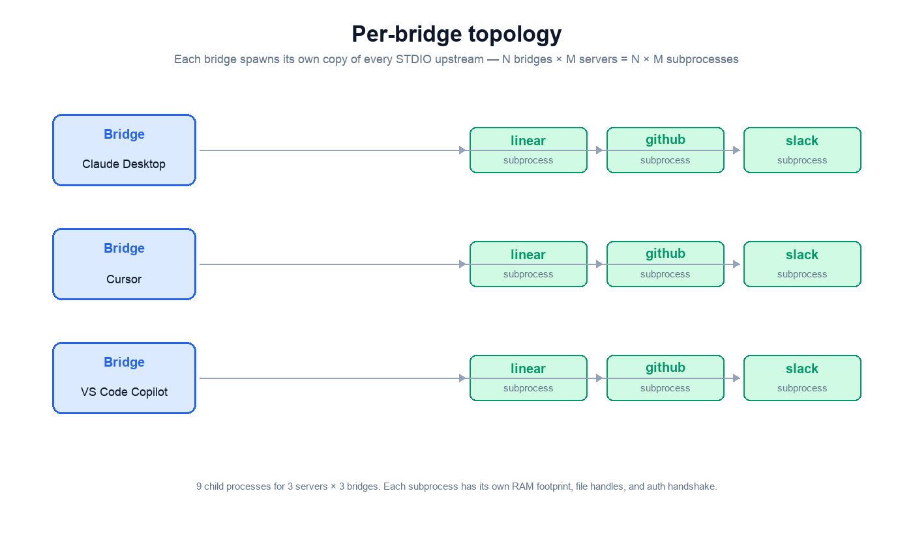
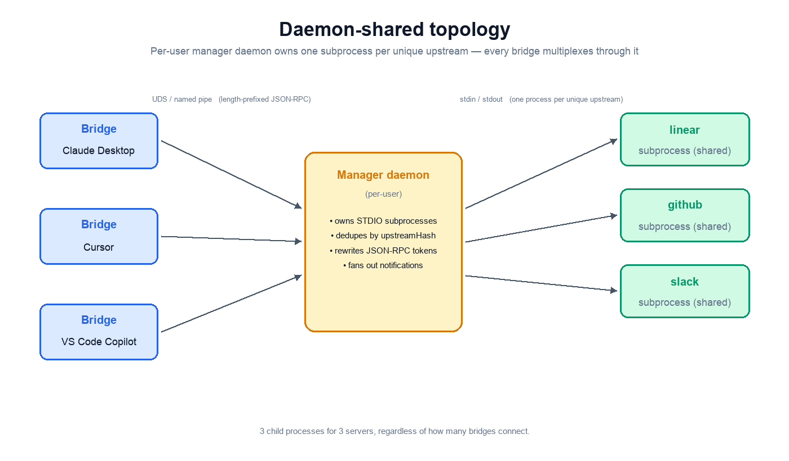

# STDIO manager

The STDIO manager is a per-user background process the bridge spawns automatically. It owns every STDIO upstream MCP server and lets multiple bridges share one subprocess per upstream — so running Claude Desktop, Cursor, and a CLI bridge against the same Linear MCP server doesn't spawn three copies of the Linear MCP server.

The manager is mandatory for STDIO upstreams; there is no inline fallback. HTTP and SSE upstreams are unaffected — each bridge connects to them directly.

## Why it exists

Without the manager, every running bridge spawns its own copy of every configured STDIO upstream MCP server. Run **N bridges** (one per editor / agent) against **M servers** and you get **N × M subprocesses**. Each one consumes its own RAM, file handles, and re-runs the upstream's auth handshake.

The manager collapses this: it owns the STDIO subprocesses and multiplexes sessions from every bridge. Identical upstream specs across bridges share a single child.





## How sharing is decided

Each upstream is identified by an **`upstreamHash`** — a SHA-256 of the canonical form of `(serverName, command, args, resolvedEnv, cwd)`. Two bridges with the same hash share a child; different credentials → different hash → different child.

Per-upstream `_bridge.sharing` setting controls behavior:

| Value | Meaning |
|-------|---------|
| `auto` (default) | Share when safe. If the upstream issues a server→client request the manager can't fan out (sampling, elicitation, roots, unknown), the hash is marked non-shareable and each session falls back to a dedicated child. |
| `shared` | Always share children with the same hash, regardless of server→client requests. |
| `dedicated` | Always spawn a fresh child per session, never share. |

```json
{
  "upstreamMcpServers": {
    "linear": {
      "command": "npx",
      "args": ["-y", "@anthropic/linear-mcp-server"],
      "_bridge": {
        "sharing": "auto"
      }
    }
  }
}
```

The bridge dedupes config entries by `upstreamHash` locally — duplicate identical entries collapse to one session before reaching the manager.

## CLI

The manager is started automatically on first bridge connect. The `daemon` subcommand exists for manual control:

```bash
crabeye-mcp-bridge daemon start      # spawn the manager (no-op if already running)
crabeye-mcp-bridge daemon stop       # graceful shutdown
crabeye-mcp-bridge daemon status     # uptime, children, sessions, telemetry
crabeye-mcp-bridge daemon restart    # stop + start
```

`crabeye-mcp-bridge daemon --internal-launch` is a hidden, internal-only entrypoint used by the bridge to fork the manager process. Don't use it directly.

### Restarting a single upstream

If the upstream binary is updated on disk but its `upstreamHash` is unchanged (e.g. `npm update -g`, `brew upgrade`, dev rebuild), the manager won't notice — its hash hasn't changed. Trigger a forced respawn manually:

```bash
crabeye-mcp-bridge daemon restart-upstream <upstreamHash>
crabeye-mcp-bridge daemon restart-upstream --all
```

Existing sessions on the killed child receive `ERR_UPSTREAM_RESTARTED { reason: "admin_restart" }`; the bridge re-OPENs on the next request, and a fresh child is spawned.

## Configuration knobs

All knobs live under `_bridge.daemon.*` in the bridge config:

| Key | Default | Meaning |
|-----|---------|---------|
| `idleMs` | `60000` | The manager self-exits this long after the last bridge disconnects. |
| `graceMs` | `60000` | A child stays alive this long after its last session detaches, in case another bridge reattaches. |
| `rpcTimeoutMs` | `30000` | Per-RPC timeout on outbound bridge→manager calls. Stalled responses past this trigger a force-respawn. |
| `heartbeatMs` | `5000` | Bridge sends a PING this often. Missed heartbeat (`heartbeatMs * 3`) trips force-respawn even with zero in-flight RPCs. |

The child grace timer and the manager's idle timer compose independently — the manager exits roughly `graceMs + idleMs` (≈2 min by default) after the last bridge disconnects.

## What happens when I edit my MCP config and save?

Bridge has hot-reload: it reads the saved config and reconciles upstream sessions. Two cases:

1. **The config change mutates the `upstreamHash`** (e.g. you changed `args`, `command`, `env`, or `cwd`). The bridge OPENs a fresh session against the new spec; the manager spawns a new child for the new hash. The old child grace-kills once its refcount drops to zero. **No manual action needed.**

2. **The config change does NOT mutate the `upstreamHash`** (e.g. you only edited `_bridge.toolPolicy`, or you upgraded the upstream binary on disk in place). The manager still has the old child cached. Bridge picks up the policy change, but the *binary* hot-swap requires:

   ```bash
   crabeye-mcp-bridge daemon restart-upstream <hash>
   ```

   This is the only case where you need to invoke the `daemon` CLI manually.

### Where do paths live?

* **Unix:** UDS at `~/.crabeye/run/manager.sock` (mode `0600`), pidfile at `~/.crabeye/run/manager.pid`, lockfile at `~/.crabeye/run/manager.lock`.
* **Windows:** named pipe restricted to the current user.

## Failure handling

* **Manager crash / SIGKILL.** Bridge detects via socket close, force-respawns the manager (lock-first to mitigate recycled-pid hazards), re-OPENs every session. Read-only in-flight requests (`tools/list`, `prompts/list`, `resources/list`, `resources/read`, `resources/templates/list`, `prompts/get`) silently retry; everything else surfaces `ERR_UPSTREAM_RESTARTED { reason: "daemon_respawn" }`.
* **Stalled manager (RPC handler sleeps).** Bridge's heartbeat watchdog or per-RPC timeout fires; the bridge SIGKILLs the manager via `manager.pid` and respawns.
* **Two-bridge race.** Loser blocks on `manager.lock` for up to `rpcTimeoutMs * 2` (60s default), then connects to whichever manager process ended up bound to the socket. On lock-wait timeout, the bridge surfaces `ERR_UPSTREAM_RESTARTED` and stops attempting.
* **Orphaned children from a dead manager.** Each manager runs `ProcessTracker.reapStale()` on startup so children leaked by a previous crashed manager get reaped before the new manager binds the socket.

## Notification fan-out

The manager broadcasts certain upstream notifications across every session sharing the child:

| Notification | Manager behavior | Forwarded to MCP client? |
|--------------|------------------|--------------------------|
| `notifications/tools/list_changed` | Broadcast to every attached session. | **Yes** — each bridge forwards to its MCP client. |
| `notifications/prompts/list_changed` | Broadcast to every attached session. | No — bridge does not implement this surface. |
| `notifications/resources/list_changed` | Broadcast to every attached session. | No — bridge does not implement this surface. |
| `notifications/resources/updated` | Routed by per-session subscription tracker (only sessions that subscribed get the notification). | Yes. |
| `notifications/progress`, `notifications/cancelled` | Routed to the originating session via rewritten progress/request tokens. | Yes. |
| `notifications/message` (logging) | Broadcast to every attached session. | Yes. |

## Auto-fork

If an upstream issues a server→client *request* the manager cannot fan out (e.g. `sampling/createMessage`, `elicitation/create`, `roots/list`, or any unknown method), the manager:

1. Marks the `upstreamHash` non-shareable.
2. Spawns a dedicated child per attached session.
3. Replays cached `initialize` and per-session `resources/subscribe` against each new child.
4. Drains the old child cleanly: pending requests get a chance to complete (bounded by `autoForkDrainTimeoutMs`); pending non-idempotent requests surface a typed error.
5. Routes the triggering request to the originating session only.

After auto-fork, future `auto`-mode OPENs for that hash spawn fresh dedicated children — the hash is "tainted" for the manager's lifetime.

## Telemetry

The manager's `STATUS` RPC returns a `telemetry` object alongside the existing `children[]` and `sessions[]` arrays:

```jsonc
{
  "uptime": 1234567,
  "pid": 8412,
  "version": 1,
  "children": [ /* ... */ ],
  "sessions": [ /* ... */ ],
  "telemetry": {
    "children": {
      "total": 3,                        // gauge: live children right now
      "spawnedTotal": 12,                // counter: spawns since manager start
      "killedTotal": {
        "grace": 7, "restart": 2,
        "fork": 0, "crash": 0
      }
    },
    "sessions": {
      "total": 5,                        // gauge: live sessions right now
      "openedTotal": 24,
      "closedTotal": 19
    },
    "fork": { "eventsTotal": 0 },        // upstreamHash non-shareable transitions
    "rpc": {
      "inFlight": 1,                     // gauge
      "errorsTotal": { "invalid_params": 3 }
    }
  }
}
```

All counters are **process-lifetime** — they reset to zero on manager respawn. Observers detect a respawn by watching `uptime` go backwards.

`killedTotal` reasons:

* **`grace`** — refcount dropped to zero and the `graceMs` timer fired.
* **`restart`** — admin `RESTART` RPC (CLI `daemon restart-upstream`).
* **`fork`** — child killed during auto-fork dedicated-spawn migration.
* **`crash`** — child exited unexpectedly (non-zero exit, or signal the manager did not send).

### Force-respawn events (bridge-side)

Bridge force-respawns of the manager are **not** counted in `killedTotal` — by the time the new manager is up the old one is gone. Each force-respawn shows up as a structured INFO log line emitted by the bridge:

```jsonc
{ "level": "info", "msg": "force_respawn", "component": "daemon-stdio",
  "event": "force_respawn",
  "reason": "heartbeat_miss" | "rpc_timeout" | "socket_close",
  "sessionId": "<uuid>", "sessionsReopened": 1 }
```

Each manager-stdio transport in the bridge owns one session, so each transport emits one log line per respawn it observes.
